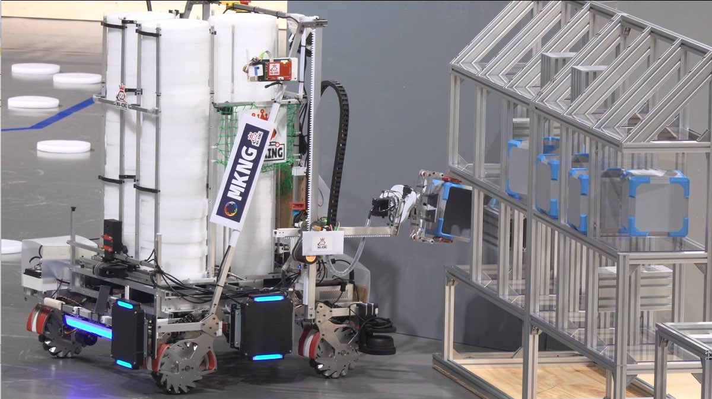
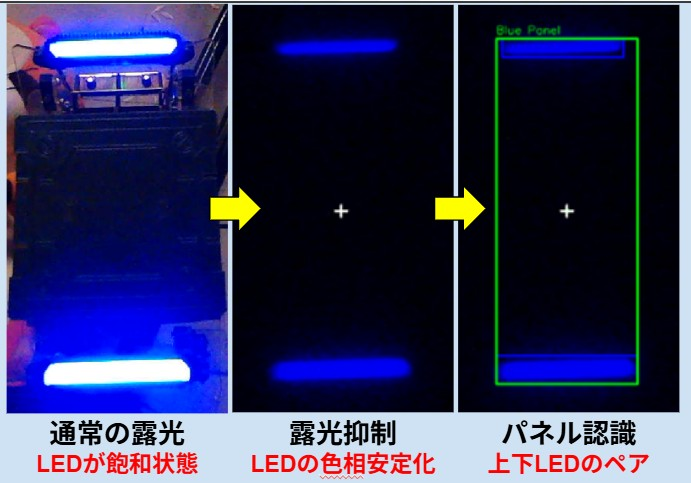
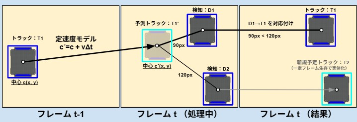
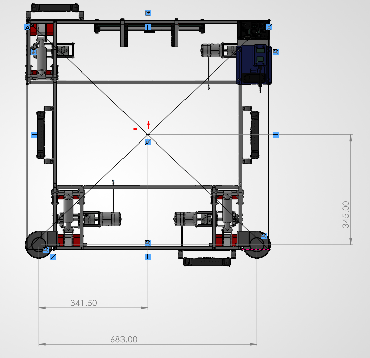
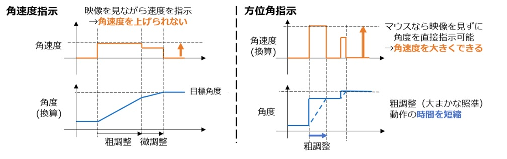
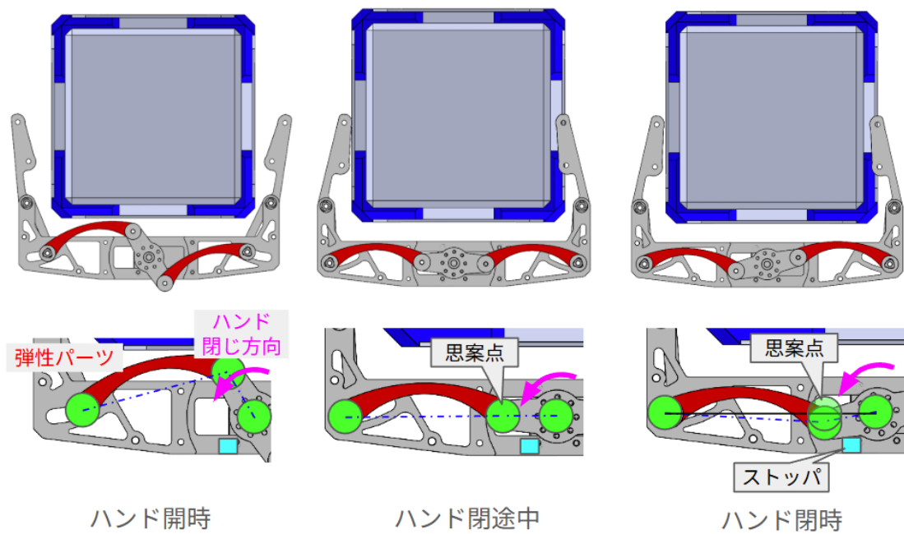
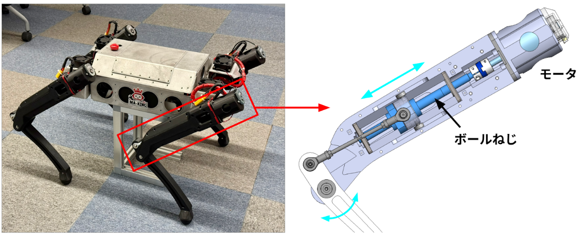
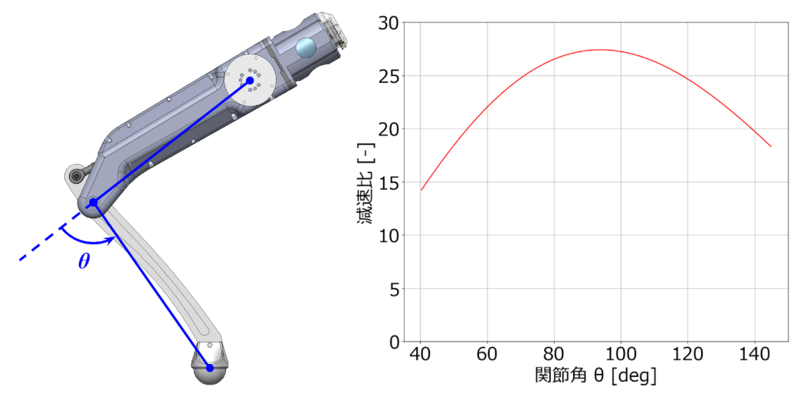

<link rel="stylesheet" href="{{ '/assets/css/style.css' | relative_url }}">

# 全体コンセプト
今年度も去年度達成できなかった競技優勝+総合優勝を目指して開発を行いました。開発ロボットとしては引き続きアタッカーとストライダーの開発を行いました。 

[今回のルール](https://github.com/scramble-robot/CoRE-Rulebook/blob/main/core_1_rulebook.md)ではVP(勝利ポイント)とRP(資源ポイント)という概念が導入されました。VPはロボット撃破で10VP獲得、RPコンテナを4つ並べて設置することで50VP獲得できます。(実質的に)勝利条件はVPの獲得が決めるという判断でMA-KINGでは50VPが勝負を分けると考えてRPコンテナ回収をできるように開発を行いました。
{:class="responsive-image"}

# アタッカー開発
アタッカーの基本機能である射出機構と足回りは基本的には昨年度の流用です。ただ、足回りについてはサスペンション部分は流用しつつも後述する足回りのレイアウトは改修しています。射出機構についてもピッチ調整機構を取り除きシンプルな構造にしました。
今回のMA-KINGは主に操縦者の補助機構の充実と、RPコンテナの回収機構を行うことにしました。   
補助機能の充実ということで、「自動射出」「自動回避」「キーボードマウスI/F」機能を開発しました。RPコンテナ回収機構はルール発表までは補助機能の充実のみに注力する予定でしたが、ルールを見てダメージパネルの取り付け位置制約が変わっていたり、RPコンテナ回収をやらないといけないと思ってアームを配置するため足回りレイアウトから大幅大改修が行われました。

## アタッカー補助機能
### 自動射出
自動射出のためのパネル認識には露光量を大きく絞ってLED以外の色が見えないように調整した状態で、色のパターンマッチングにてパネル認識を行いました。これによって、背景の状況に関わらずLEDをきれいに映像に入れることができるようにしています。
トラッキングについては、認識したパネルの速度情報から次のフレームでの位置を予想し、最も近いパネルを対応させる方式をとっており、軽量でロストしづらいトラッキングを実現しました。
{:class="responsive-image"}
{:class="responsive-image"}
<blockquote class="twitter-tweet" data-media-max-width="560">
トラッキング結果を表示した場合はこんな感じです。SORTをベースにCoRE競技向けの改良を加えています。 標準のSORTでは予測位置と検出位置の対応付けにIoUを用いますが、高速移動や振動が大きい環境では不安定になるため、本システムでは画素距離ベースの評価に変更しています。 <a href="https://t.co/pshaKrVCAL">pic.twitter.com/pshaKrVCAL</a>
&mdash; ズズくん＠CoRE（MA-KING）、マイクロマウス (@zuzukun1129) <a href="https://twitter.com/zuzukun1129/status/2020143990071239009?ref_src=twsrc%5Etfw">February 7, 2026</a></blockquote> 
射出方向の調整機構と合わせて自動照準までやろうとしていましたが、そこまでは間に合わず画角にパネルがあった時に射出指令を出す方式にしました。実際の試合でも自動射出によってダメージを与えることができていました。今年のルールでは自動射出出ないと2つ目の射出機構を搭載することが禁止されていたため、この機能を搭載したことによって、搭載できるディスクの枚数を増やせるようになり試合的にも有利に進めることができたと思います。

### 自動回避機能
自動回避機能はLiDARによって近くにある物体からの斥力を計算し、その斥力に対応する機体の速度入力を追加で入力することで障害物回避を行いました。斥力はガウス関数を用いて機体から取得した各点までの距離を用いて斥力ベクトルを計算し、その総和を機体に与える斥力ベクトルとしました。ガウス関数の分散やゲインは実機に適応して実験的にゲインを決定しました。  
MA-KINGのシステムはLiDARの点群周りの処理はPCで行い、そこで計算した斥力ベクトルを機体制御用のマイコンで送る構成をとっており、PCからマイコンへ送る情報を2次元ベクトルの情報のみにして通信量を小さくしています。
<blockquote class="twitter-tweet" data-media-max-width="560">
機体にLiDARを搭載して衝突回避機能を試しています！ 操縦者が周囲を気にしなくても障害物をいい感じに避けて動いてくれています！<a href="https://twitter.com/hashtag/CoREjp?src=hash&amp;ref_src=twsrc%5Etfw">#CoREjp</a><a href="https://twitter.com/hashtag/CoREjp_MAKING?src=hash&amp;ref_src=twsrc%5Etfw">#CoREjp_MAKING</a> <a href="https://t.co/ZF3928ybvR">pic.twitter.com/ZF3928ybvR</a>
&mdash; MA-KING (@ma_king_core) <a href="https://twitter.com/ma_king_core/status/2002666378717974710?ref_src=twsrc%5Etfw">December 21, 2025</a></blockquote> 

本来であれば全方位LiDARで検知できるようするのがよさそうですが、CoREにおいては、基本的にカメラ操縦ができるため前方の回避機能の優先度は低いことや、壁の高さタイヤ、ダメージパネルのレイアウトの制約などがあるため、このような配置になっています。これでも操縦者は後ろや左右の状態を気にすることなく操縦や射出に集中することができるようにしています。

{:class="responsive-image"}

### キーボードマウスインターフェースの開発
CoREにおいて、アタッカーの操縦のための無線通信には、映像遅延と無線操縦の遅延2つの遅延要素があります。これらの解消のために入力方法の検討を行いました。  
操縦者が見るロボット映像や操縦モジュールの通信周期が遅いことによる遅延があります。このため照準合わせをするとき微調整の指令を出してから実際に操縦画面に反映されるまで遅延が発生するため最後の微調整に時間がかかる・危なくて速度を上げづらいという問題があります。
以前まではロボットに対して角速度の指令値を送っていましたが、ラグのせいでうまく照準を合わせるのが難しかったです。そこで目標角度を指定できるような方式に変更しました。
{:class="responsive-image"}

図に示したように、方位角を指示する仕様にしました。これは入力にマウスの移動量を使うようにしています。マウスの移動量に応じた角度を指定するようにしたため、操縦者は動かしたい角度分マウスを動かせば映像遅延などを無視して指令を送ることができます。これにより以前まで課題だった微調整を手の間隔だけで決めることができるようになり遅延の影響を少なくすることができました。また、角度の制御を行っているため、ロボット内部のローカルの角速度は大きくすることができるため追従性を上げることができ調整時間の大幅な短縮もできるようになりました。
<blockquote class="twitter-tweet" data-media-max-width="560">
照準を合わせやすくするためにマウスとキーボードで操縦できるようにしました！ <a href="https://twitter.com/hashtag/CoREjp?src=hash&amp;ref_src=twsrc%5Etfw">#CoREjp</a> <a href="https://twitter.com/hashtag/CoREjp_MAKING?src=hash&amp;ref_src=twsrc%5Etfw">#CoREjp_MAKING</a> <a href="https://t.co/QjuWXbCaIM">pic.twitter.com/QjuWXbCaIM</a>
&mdash; MA-KING (@ma_king_core) <a href="https://twitter.com/ma_king_core/status/1967224487830770115?ref_src=twsrc%5Etfw">September 14, 2025</a></blockquote> 

## ソフトウェア基盤の開発
ソフトウェア基盤の整備も行いました。Zenohという通信ミドルウェアを利用することで、各アプリのマイクロサービス化や多言語対応ができるようになったりしています。
もともとのPCソフトとしては、映像伝送用の画像出力とパネル認識のソフトのみだったところ、上記の自動回避機能など機能追加がしたかったこともあり、マイクロサービス化を行いました。  
こちらの記事に詳細は書いています⇩  
[ロボコンSWでのZenoh による柔軟なシステム設計](https://zenn.dev/mio2/articles/making_roboapp_2026
)

## RPコンテナ回収アームの開発
アームの昇降機構にはEduLite 05とラックアンドピニオンを使ったシンプルな直動機構を採用しています。ハンドにはリンクの思案点を活用した、保持機構が搭載されています。思案点を超えたところまでモータを回すとそれ以降外からの力ではストッパ側に力がかかるため電力供給を止めてもハンドが開かなくなります。実際の試合でも撃破時に電源が落とされてもコンテナをつかんだままの状態を保持することができました。
{:class="responsive-image"}

手首機構にはカムを用いて1モータで競技で必要な5方向に手首を回転させることができるようになっています。

# ストライダー開発
ストライダーは完全オリジナル設計です。
Soptなどでみられるボールねじを使った直動減速機構を用いた膝機構が特徴です。
基本的に足は3Dプリント製ですが、ボールねじの剛性も含めて全体として剛性と軽量化を図っています。またリンクによって角度に依存した減速比が変化するようになっています。歩行で必要とされる可動域付近で減速比が大きくなるようにすることで高いトルクを使うことができるように設計されています。
{:class="responsive-image"}
{:class="responsive-image"}

学習やソフトウェアについては気が向いたら書くかも？

<blockquote class="twitter-tweet" data-media-max-width="560">
予選には間に合わなかったストライダーも今日はしっかり動きました！<a href="https://twitter.com/hashtag/CoREjp?src=hash&amp;ref_src=twsrc%5Etfw">#CoREjp</a> <a href="https://twitter.com/hashtag/CoREjp_MAKING?src=hash&amp;ref_src=twsrc%5Etfw">#CoREjp_MAKING</a> <a href="https://t.co/VlFiwbzU94">pic.twitter.com/VlFiwbzU94</a>
&mdash; MA-KING (@ma_king_core) <a href="https://twitter.com/ma_king_core/status/2035664298178138357?ref_src=twsrc%5Etfw">March 22, 2026</a></blockquote> 
