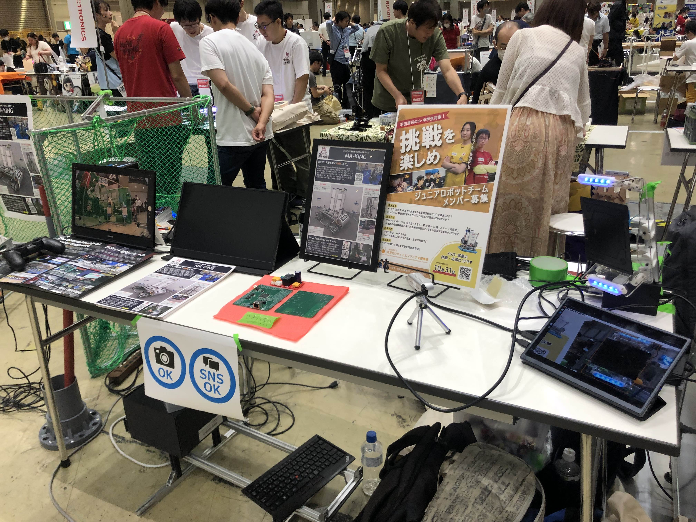

<link rel="icon" href="/favicon.ico" type="image/x-icon">

# MA-KINGについて

MA-KING(メイキング)は[CoRE](https://core.scramble-robot.org/)出場のために結成された社会人チームです。  
進捗は[#CoREjp_MAKING](https://twitter.com/search?q=%23CoREjp_MAKING)や[MA-KINGツイッター](https://twitter.com/ma_king_core)にて発信しています。

# 2025年大会
## 広報活動
### MFT2024
[MFT2024](https://makezine.jp/event/makers-mft2024/m0174/)に出展しました！  
出展目的はこちらの[ブログ](https://blog.mmaakkyyii.com/posts/post53/)にてまとめています。
出展者向け懇親会でLTがあり、そこでCoREの宣伝をしてきました。

### [tofuConf](https://tofuconf.club/2024-08-26/we-held-the-18th-tofuconf.html) 
小さめの会ですが、CoREの布教LTをしてきました。

# 2024年大会
## 戦績
2024年度大会は[総大将決定戦](https://www.youtube.com/live/vzNiVW0RnFI?si=99GYdgR8uguHoofI)では第8位  
[大ロボーズ](https://core.scramble-robot.org/player_team/dairobos/)傘下にて決勝トーナメントに出場  
[準決勝](https://www.youtube.com/live/S1zGDQoMSXo?si=l3i_r7DlhmGuDFUf)では2-0で勝利  
[決勝戦](https://www.youtube.com/live/UWSe1TFjZzk?si=oNLwdvn6uPN005K1)では3-2で勝利(5試合に出場)  
[ブログ記事](https://blog.mmaakkyyii.com/posts/post51/)

## コンセプト
まずは大会に出て動かすこと！  
時間がないのは自明なので余計なことはなるべくしない！(とはいいつついろいろ盛りこんだりしましたが)

  

## [ギャラリーはこちら](gallery.md)

# リンク集
Twitter(X) [@ma_king_core](https://twitter.com/ma_king_core)  
GitHub [https://github.com/CoRE-MA-KING](https://github.com/CoRE-MA-KING)

