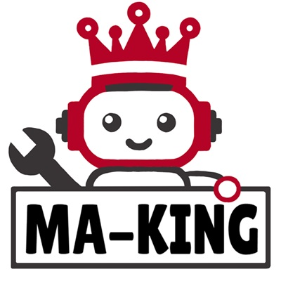

<link rel="icon" href="/favicon.ico" type="image/x-icon">

# MA-KINGについて

MA-KING(メイキング)は[CoRE](https://core.scramble-robot.org/)出場のために結成された社会人チームです。  

  

# 2024年大会
## 戦績
2024年度大会は[総大将決定戦](https://www.youtube.com/live/vzNiVW0RnFI?si=99GYdgR8uguHoofI)では第8位  
[大ロボーズ](https://core.scramble-robot.org/player_team/dairobos/)傘下にて決勝トーナメントに出場  
[準決勝](https://www.youtube.com/live/S1zGDQoMSXo?si=l3i_r7DlhmGuDFUf)では2-0で勝利  
[決勝戦](https://www.youtube.com/live/UWSe1TFjZzk?si=oNLwdvn6uPN005K1)では3-2で勝利(5試合に出場)  

## コンセプト
まずは大会に出て動かすこと！  
時間がないのは自明なので余計なことはなるべくしない！(とはいいつついろいろ盛りこんだりしましたが)

## ギャラリー
  
  

# リンク集
Twitter(X) [@ma_king_core](https://twitter.com/ma_king_core)  
GitHub [https://github.com/CoRE-MA-KING](https://github.com/CoRE-MA-KING)

